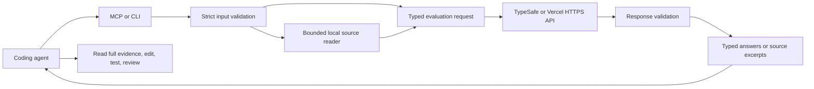

# Architecture

The root is pinned when the server starts. Tool callers supply relative file names; they cannot switch the root or the API destination. The context tool reads a bounded candidate list and presents chunks to Jev, then returns selected excerpts and provenance. An omitted excerpt is not evidence that a feature is absent.

Chunks end at line boundaries and do not overlap. CRLF is normalized to LF in returned excerpts, and the digest identifies the returned excerpt. A definition split across a boundary may need a wider follow-up read. Files are admitted in caller order, then chunk slots are allocated round robin across admitted files. Evaluated excerpts are ranked before applying the output budget. Current limits are 24 evaluated chunks per call, six per request, 24 KiB per state, and 16 KiB for the context result object. MCP's text and structured representations add serialization overhead.

The provider client shares one contract across CLI, MCP, context selection, and evaluation. It checks request sizes and question schemas before remote inference. It checks answer IDs, answer types, distributions, and values after inference. A malformed answer becomes an error, never a positive decision.

Credentials are resolved outside tool arguments. Each selected provider has a fixed production endpoint. Constructor injection exists for library tests, where a local HTTP stand-in exercises the actual request/response protocol. Test doubles are isolated from production configuration.

Every evaluated but withheld excerpt gets a recovery reference while the metadata budget permits it. The response separately counts filtered, budget-omitted, unscanned, and skipped evidence. Metadata omissions are explicit. `incomplete` describes withheld source evidence, not just transport success.

The adapter does not persist source contents, prompts, results, or credentials. There is no hidden cache. This avoids stale relevance decisions after edits and avoids retaining private source on disk. Callers can retain explicit result artifacts in their own workflow if needed.

Model output is advisory. The orchestrator decides whether to read more evidence, use a specialist, or run a test. No model answer can expand the filesystem root, change the provider URL, execute a command, or bypass a deterministic validation failure.
